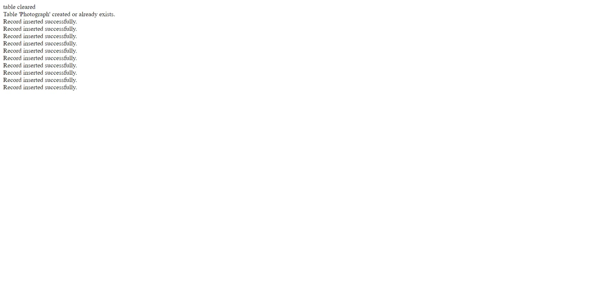

# Famous Buildings Database - PHP Project with SQL

## Description
Explore the world of architecture with this PHP-based application integrated with SQL, managing a database of 10 renowned buildings worldwide. Dive into functionalities allowing seamless insertion, retrieval, and display of building records. Experience distinct webpages designed for various operations, from data insertion to dynamic image displays based on location and year criteria. Discover the intersection of PHP and SQL in managing and presenting famous architectural landmarks.

## Link and Screenshots

**lab09a.php**:

Link to website: https://webdev.cs.torontomu.ca/~asipahi/lab09a.php

**lab09b.php**:

Link to website: https://webdev.cs.torontomu.ca/~asipahi/lab09b.php

**lab09c.php**:

Link to website: https://webdev.cs.torontomu.ca/~asipahi/lab09c.php

**lab09d.php**:

Link to website: https://webdev.cs.torontomu.ca/~asipahi/lab09d.php

**lab09e.php**:

 Link to website: https://webdev.cs.torontomu.ca/~asipahi/lab09e.php

## Key Features
- **lab09a.php**: Inserts records into the database, maintaining building information.
- **lab09b.php**: Displays database records in a tabular format, providing easy access to stored information.  
- **lab09c.php**: Features Ontario-based pictures, dynamically showing these images on the page.  
- **lab09d.php**: Enables users to search for images based on location and year criteria, showcasing matching pictures or displaying all images based on selected parameters.  
- **lab09e.php**: Implements functionality to display a random image from the database upon page refresh, accompanied by image details. Additionally, includes a count of total images in the database at the page's bottom. 

## Usage
1. Access each lab file (`lab09a.php`, `lab09b.php`, etc.) in a web browser to perform specific functions.
2. Insert, retrieve, and display building records using the provided webpages.
3. Use search functionality to filter images based on location and year criteria.
4. Experience the dynamic display of Ontario-based pictures and a random image with details upon page refresh.

## VPN Requirement
- **Note**: Connection via Ryerson VPN is required to access and interact with the application.   

## Technology Stack
- **PHP**: Backend scripting language for database operations.
- **SQL**: Database management for storing and retrieving building records.
- **HTML/CSS**: Frontend for webpage structure and styling.

## Note
Ensure proper SQL database setup and connectivity for the application to function correctly.

## License
This work is licensed under a [Creative Commons Attribution-NonCommercial 4.0 International License](http://creativecommons.org/licenses/by-nc/4.0/). To view a copy of this license, visit the link above or send a letter to Creative Commons, PO Box 1866, Mountain View, CA 94042, USA.
